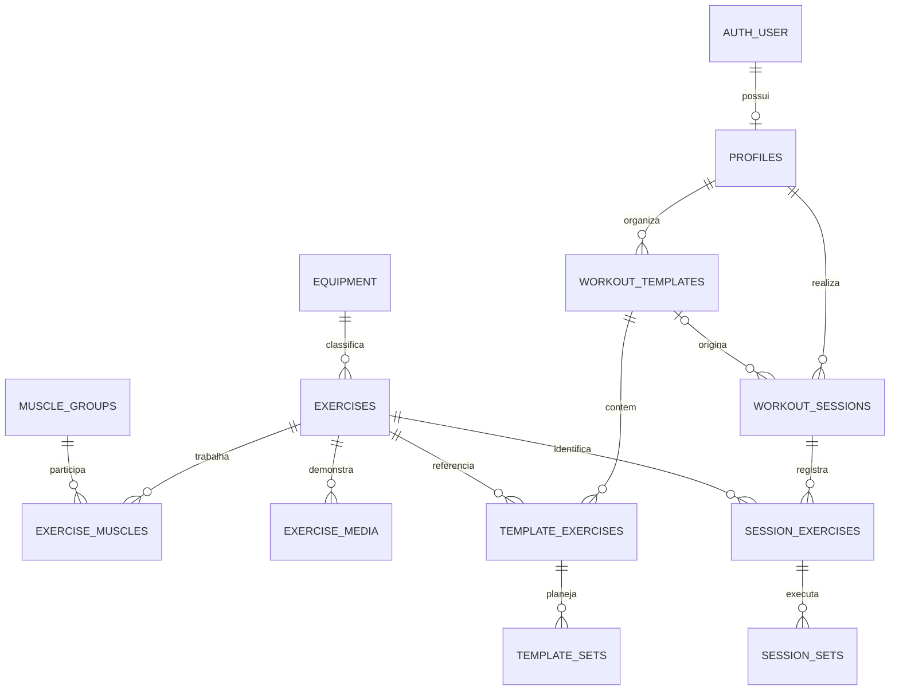

# GymLog — planejamento do banco de dados

**Status: modelo aprovado; estrutura inicial aplicada em 2026-09-04.** Veja [operação do banco](database-operations.md) para migrations, validações e pendências de integração com a API. As seções abaixo preservam o planejamento do produto; a estrutura executável está em `database/migrations`.

## Escopo e decisões propostas

Cobrir todas as funcionalidades do README: catálogo e seleção de exercícios, GIFs, montagem de treinos, registro de séries/repetições/cargas, histórico e persistência por usuário. PostgreSQL 18 no Neon em São Paulo; acesso pela API na Vercel.

A decisão central é separar **ficha planejada** de **sessão realizada**. Editar o treino A amanhã não pode mudar o que foi registrado hoje.

Premissas para a primeira versão:

- Cada conta administra seus próprios treinos e histórico.
- Catálogo compartilhado, mantido pelo projeto, com filtro por músculos e equipamento.
- Fichas reutilizáveis A/B/C; também permitir treino avulso sem ficha.
- Cargas em kg e tempos em segundos. Interface inicialmente em português.
- Uma sessão em andamento por usuário; retomada em outro dispositivo com internet.
- Séries de aquecimento e trabalho; exercícios por repetição ou tempo, incluindo prancha.
- Carga externa, peso corporal e assistência, sem misturar essas medidas nas estatísticas.
- Exercícios personalizados, offline, treinadores, compartilhamento e medidas corporais são extensões futuras, não requisitos do README atual.

## Visão das tabelas

São **12 tabelas de domínio**, além das tabelas do Neon Auth.

| Tabela | Responsabilidade |
| --- | --- |
| `profiles` | Perfil do usuário e fuso horário |
| `muscle_groups` | Grupos musculares |
| `equipment` | Categorias de equipamento |
| `exercises` | Catálogo, instruções e convenções de medição |
| `exercise_muscles` | Relação N:N entre exercícios e músculos |
| `exercise_media` | URLs e origem dos GIFs, imagens ou vídeos |
| `workout_templates` | Fichas reutilizáveis |
| `template_exercises` | Exercícios ordenados de uma ficha |
| `template_sets` | Metas individuais de cada série |
| `workout_sessions` | Cada treino iniciado ou realizado |
| `session_exercises` | Exercícios daquela sessão, com cópia dos dados históricos |
| `session_sets` | Séries realizadas: carga, repetições, tempo e estado |

## Convenções de dados

- Aplicação no schema `public`; `neon_auth` é gerenciado pelo serviço de autenticação.
- PKs próprias: `uuid DEFAULT uuidv7()`. O perfil reutiliza o UUID da identidade.
- Datas: `timestamptz`. Usar fuso IANA do perfil para exibição e agrupamento diário; não salvar horários locais sem fuso.
- Cargas: `numeric(8,3)`, para decimal exato. Padronizar a serialização desses decimais na API.
- Estados e tipos: `text` com `CHECK`, alterados por migrations quando necessário.
- Entidades mutáveis têm `created_at` e `updated_at`; trigger comum mantém `updated_at`.
- Nomes até 120 caracteres, notas até 2.000; validar no banco e na API.
- `NULL` significa não informado; `0` pode significar peso corporal sem carga adicional. Nunca converter silenciosamente um no outro.

## Identidade

### `profiles`

| Campo | Tipo / regra |
| --- | --- |
| `id` | UUID, PK e FK para `neon_auth.user(id)` |
| `display_name` | Texto |
| `timezone` | Texto, default `America/Sao_Paulo`; validar identificador IANA |
| `created_at`, `updated_at` | Datas |

Uma consulta somente de metadados confirmou que **neste banco** existe `neon_auth.user.id` do tipo `uuid`. Reconfirmar nos ambientes de desenvolvimento e produção antes de aplicar a migration. Não assumir o formato a partir de exemplos antigos do Neon.

Email, senha, sessões de login e recuperação de acesso ficam no Neon Auth. Não duplicar credenciais. Criar o perfil com upsert idempotente após validar a primeira sessão autenticada.

## Catálogo

### `muscle_groups`

`id`, `slug UNIQUE`, `name`, `created_at`, `updated_at`.

Seed inicial: peito, costas, ombros, bíceps, tríceps, quadríceps, posteriores, glúteos, panturrilhas e abdômen. Slugs estáveis permitem reexecutar o seed sem duplicações.

### `equipment`

`id`, `slug UNIQUE`, `name`, `created_at`, `updated_at`.

Seed: barra, halteres, máquina, polia, elástico, sem equipamento. Uma categoria principal por exercício na primeira versão. Uma relação N:N pode ser introduzida se filtros por combinações de equipamentos se tornarem necessários.

### `exercises`

| Campo | Tipo / regra |
| --- | --- |
| `id`, `slug` | UUID PK; slug único |
| `name`, `description` | Texto; descrição opcional |
| `instructions` | `text[]`, passos ordenados; pode estar vazio até a curadoria |
| `equipment_id` | FK para equipamento |
| `tracking_mode` | `reps` ou `duration` |
| `load_mode` | `external`, `bodyweight` ou `assisted` |
| `load_convention` | `total`, `per_hand`, `machine`, `added` ou `assistance` |
| `archived_at` | Data opcional para desativar sem perder referências |
| `created_at`, `updated_at` | Datas |

Supino com barra e supino com halteres são exercícios diferentes. A interface deve indicar a convenção da carga: peso total incluindo a barra, peso por halter, valor da máquina, peso adicional ao corpo ou assistência. Assistência é um número positivo, não carga negativa. Validar combinações de modo/convenção na API.

### `exercise_muscles`

`exercise_id` FK, `muscle_group_id` FK e `role` (`primary` ou `secondary`). PK composta `(exercise_id, muscle_group_id)`.

Um exercício pode trabalhar vários músculos. Exigir ao menos um músculo principal ao publicar o exercício pela rotina de curadoria; essa regra entre linhas não cabe em um `CHECK` simples.

### `exercise_media`

`id`, `exercise_id` FK, `kind` (`gif`, `image`, `video`), `url`, `alt_text`, `position`, `provider` opcional, `external_id` opcional, `source_url` opcional, `license` opcional, `attribution` opcional, `created_at`, `updated_at`.

`UNIQUE(exercise_id, position)`; posição positiva. A primeira mídia é a principal. URLs HTTPS e permanentes; não persistir URLs assinadas que expiram como endereço definitivo. Armazenar os arquivos fora do PostgreSQL, guardando apenas metadados e referências.

Exercícios sem GIF continuam utilizáveis com instruções. Definir fornecedor e direitos de uso antes de importar mídias; manter origem e atribuição conforme a licença. Links quebrados podem ser substituídos sem modificar treinos.

## Fichas reutilizáveis

### `workout_templates`

`id`, `user_id` FK, `name`, `notes` opcional, `position` positiva, `version` inteiro default 1, `archived_at` opcional, `created_at`, `updated_at`.

Exemplo: “A — Peito e tríceps”. Nomes não precisam ser únicos. Arquivar uma ficha retira da seleção padrão, preservando as sessões já realizadas.

### `template_exercises`

`id`, `user_id`, `template_id`, `exercise_id`, `position`, `notes` opcional, `created_at`, `updated_at`.

`UNIQUE(template_id, position)`. O exercício pode aparecer mais de uma vez na ficha. FK composta `(template_id, user_id)` garante que o item pertence ao mesmo usuário da ficha. Referência ao catálogo por `exercise_id`.

### `template_sets`

| Campo | Tipo / regra |
| --- | --- |
| `id`, `user_id`, `template_exercise_id` | Identidade, proprietário e exercício planejado |
| `position` | Inteiro positivo, único por exercício planejado |
| `set_type` | `warmup` ou `working` |
| `target_reps_min`, `target_reps_max` | Inteiros positivos opcionais; ambos nulos ou ambos preenchidos; min ≤ max |
| `target_duration_seconds` | Inteiro positivo opcional |
| `target_load_kg` | Decimal não negativo opcional |
| `rest_seconds` | Inteiro não negativo opcional |
| `created_at`, `updated_at` | Datas |

Uma linha por série permite aquecimento e séries de trabalho com metas diferentes. Não duplicar a contagem em `sets_count`. Metas podem estar vazias; quando preenchidas, repetição e duração são mutuamente exclusivas e devem corresponder ao modo do exercício. A API valida essa compatibilidade dentro da transação de edição.

## Treinos realizados

### `workout_sessions`

| Campo | Tipo / regra |
| --- | --- |
| `id`, `user_id` | Identidade e proprietário |
| `template_id` | FK opcional para ficha do mesmo usuário |
| `name` | Cópia do nome da ficha ou título do treino avulso |
| `status` | `in_progress`, `completed`, `cancelled` |
| `started_at` | Instante de início; permite registrar treino retroativo |
| `ended_at` | Nulo em andamento; obrigatório nos estados finais |
| `notes` | Opcional |
| `version` | Inteiro default 1 |
| `created_at`, `updated_at` | Datas de gravação |

`ended_at >= started_at`. Índice único parcial por `user_id WHERE status = 'in_progress'` garante uma sessão ativa por pessoa. Um treino retroativo pode ser criado já concluído, atomicamente, sem competir com a sessão ativa.

Para concluir: exigir ao menos uma série concluída, nenhuma pendente e métricas válidas, sob lock da sessão. O usuário pode marcar as pendentes como puladas. Cancelamento preserva os registros parciais, excluindo-os das estatísticas padrão.

### `session_exercises`

`id`, `user_id`, `session_id`, `exercise_id`, `position`, `notes` opcional, `exercise_name_snapshot`, `tracking_mode_snapshot`, `load_mode_snapshot`, `load_convention_snapshot`, `created_at`, `updated_at`.

`UNIQUE(session_id, position)` e FK composta de sessão/proprietário. Os snapshots preservam a interpretação histórica mesmo se o catálogo mudar. `exercise_id` permite consultar mídia e instruções atuais. Não copiar GIFs nem depender da existência do item original da ficha.

### `session_sets`

| Campo | Tipo / regra |
| --- | --- |
| `id`, `user_id`, `session_exercise_id` | Identidade, proprietário e exercício realizado |
| `position`, `set_type` | Ordem positiva única por exercício; aquecimento ou trabalho |
| `target_reps_min`, `target_reps_max` | Cópia opcional das metas |
| `target_duration_seconds`, `target_load_kg`, `rest_seconds` | Cópia opcional do planejamento |
| `actual_reps` | Inteiro positivo opcional |
| `actual_duration_seconds` | Inteiro positivo opcional |
| `actual_load_kg` | Decimal não negativo opcional |
| `status` | `pending`, `completed`, `skipped` |
| `completed_at` | Obrigatório apenas em `completed`; nulo nos demais estados |
| `notes` | Opcional |
| `created_at`, `updated_at` | Datas |

Aplicar às metas copiadas as mesmas regras de `template_sets`. Uma série pendente pode guardar um rascunho. Uma concluída exige a métrica correspondente ao snapshot do exercício. Repetição e duração realizadas são mutuamente exclusivas. Carga externa e assistência exigem valor; peso corporal sem peso adicional grava zero. Validar consistência entre pai e filho na transação.

**Não preencher o realizado automaticamente com a meta.** Sugerir 40 kg na interface não significa que o usuário executou 40 kg.

## Integridade e exclusões

- Todas as tabelas privadas têm `user_id`. Pais privados têm `UNIQUE(id, user_id)`; filhos usam FKs compostas. Isso impede ligar uma série ao treino de outra pessoa.
- A FK opcional `(template_id, user_id)` da sessão aponta para a ficha do mesmo usuário. Fichas referenciadas são arquivadas, não apagadas isoladamente.
- Exercícios e taxonomias referenciados usam `RESTRICT`. Arquivar exercícios antigos em vez de remover suas referências históricas.
- Exclusão explícita de sessão usa `CASCADE` somente em seus exercícios e séries. Remover exercício da ficha apaga suas metas, nunca o realizado.
- Exclusão de conta: bloquear acesso, remover sessões, fichas e perfil, então solicitar exclusão da identidade no Neon Auth. Usar `RESTRICT` na FK da identidade para evitar exclusões parciais acidentais. Esse fluxo entre serviços precisa ser retomável, não uma suposta transação única.
- Reordenações com UNIQUE de posição: usar constraints `DEFERRABLE` ou atualização em duas etapas dentro da mesma transação.
- Textos não vazios, posições positivas, decimais finitos não negativos e estados válidos devem ser garantidos no banco. Regras envolvendo outras linhas precisam de transação/lock ou trigger, não apenas `CHECK`.

## Autorização

1. Validar sessão/token pelo Neon Auth antes das rotas privadas.
2. Resolver o proprietário pela sessão validada; nunca confiar no `user_id` recebido do navegador.
3. Filtrar proprietário em toda leitura e escrita privada. As FKs compostas reforçam integridade, mas não substituem autorização.
4. Separar papel administrativo de migrations do papel usado pela API; aplicar privilégios mínimos.
5. Adotar RLS nas tabelas privadas como segunda barreira. Configurar o contexto do usuário localmente **na mesma transação** das consultas; sem contexto, negar acesso.
6. Com o driver HTTP do Neon, usar a operação de transação suportada para contexto + consultas. Não presumir que duas chamadas independentes reutilizam a conexão.
7. Validar com o papel real da API: ele não pode ser proprietário nem possuir `BYPASSRLS`. A conexão administrativa atual não deve ser tratada como protegida pelas políticas por padrão.
8. Catálogo: leitura por usuários autenticados; escrita apenas pela rotina administrativa. Não é necessário construir um painel de administração agora.

Antes de publicar rotas de treinos, provar em testes que a API e o banco isolam dois usuários diferentes. As tabelas do Neon Auth não devem ser modificadas por migrations da aplicação.

## Gravação e concorrência

Iniciar uma ficha copia nome, exercícios, convenções e metas para a sessão em uma única transação. Cada edição na sessão exige a versão esperada e incrementa a versão do pai junto com a gravação dos filhos. Versão antiga retorna HTTP 409, evitando que uma aba sobrescreva silenciosamente outra. Aplicar a mesma estratégia à edição de fichas.

Aceitar UUIDs de operação/registro gerados pelo cliente e validados para repetir gravações sem duplicar registros. Ao reenviar um ID, comparar proprietário e conteúdo; não sobrescrever um registro conflitante. A restrição de sessão ativa também protege contra duas abas iniciando treinos diferentes simultaneamente.

Salvar cada série e mostrar confirmação de persistência. Offline fica para uma fase própria, com fila local, resolução de conflitos e sincronização.

Exemplo:

1. Ficha A: supino, 3 séries de 8–12 repetições.
2. Iniciar: criar sessão com 3 séries pendentes e metas copiadas.
3. Registrar 40 kg × 12, 45 kg × 10 e 45 kg × 8.
4. Finalizar a sessão.
5. Alterar a ficha para 4 séries amanhã. A sessão anterior permanece com 3.

O usuário pode corrigir explicitamente seu histórico, usando controle de versão. As estatísticas refletem a correção. Não é necessário criar uma tabela de auditoria nesta primeira versão.

## Índices e estatísticas

| Uso | Índice |
| --- | --- |
| Fichas do usuário | `(user_id, archived_at, position)` |
| Histórico paginado | Sessões: `(user_id, started_at DESC, id DESC)` |
| Sessão ativa | UNIQUE parcial por `user_id` em andamento |
| Ordem de exercícios | UNIQUE `(template_id, position)` / `(session_id, position)` |
| Ordem de séries | UNIQUE `(template_exercise_id, position)` / `(session_exercise_id, position)` |
| Evolução de exercício | `session_exercises(user_id, exercise_id, session_id)` |
| Filtro por músculo | `exercise_muscles(muscle_group_id, exercise_id)` |
| Filtro por equipamento | `exercises(equipment_id)` |

Indexar as demais FKs quando não cobertas por índices que comecem pelas mesmas colunas. Evitar duplicar índices já criados por PK/UNIQUE. Histórico usa cursor `(started_at, id)`.

Busca inicial por nome com `ILIKE`; tratamento de acentos e trigram podem ser adicionados quando o comportamento de busca for definido e houver necessidade medida.

Não criar tabelas de estatísticas inicialmente. Calcular a partir de sessões concluídas e séries de trabalho concluídas:

- Última carga por exercício e convenção.
- Volume externo: repetições × carga, apenas quando a convenção permite comparação. Em halteres por mão, informar a convenção e não multiplicar implicitamente.
- Melhor carga: não misturar exercícios, máquinas/convenções distintas ou peso assistido, onde menos assistência pode representar progresso.
- Frequência semanal: sessões concluídas no fuso do usuário.
- Duração: fim menos início, descrita como tempo decorrido, não tempo ativo.

Não tratar peso adicional como peso corporal total, nem misturar duração com repetições. Sessões canceladas e séries pendentes/puladas não entram nos indicadores padrão.

## Ordem de implementação

1. Revisar as premissas e decidir se exercícios próprios ou libras já são necessários.
2. Criar branch de desenvolvimento no Neon, separada da produção.
3. Criar migrations SQL versionadas: perfil; catálogo; fichas; sessões; índices e políticas.
4. Integrar Neon Auth, papel da API e RLS; testar isolamento entre dois usuários.
5. Criar seed idempotente por slug e importar somente mídias com uso autorizado.
6. Entregar catálogo e CRUD de fichas.
7. Entregar sessões: início, salvamento, retomada, finalização e correção.
8. Entregar histórico e evolução usando consultas aos registros reais.

Testes de aceite: edição de ficha não muda histórico; usuário não acessa outro; início simultâneo não duplica sessão; gravação repetida não duplica série; versão antiga gera conflito; zero difere de nulo; arquivamento preserva referências; ausência de GIF não bloqueia treino; fuso não altera instantes; conclusão exige séries válidas; FK rejeita filho com proprietário incorreto.

## Pontos para revisão de produto

Recomendação inicial: catálogo curado compartilhado, kg, uma sessão ativa e correção posterior do histórico. Exercícios próprios exigirão propriedade/visibilidade do catálogo; libras exigirão unidade explícita por registro. Se forem parte do primeiro lançamento, incluir antes das migrations.

A escolha e licença do fornecedor dos GIFs continuam abertas. Isso não impede criar o catálogo e suas tabelas de metadados.

## Fontes técnicas

- [Neon Auth e schema gerenciado](https://neon.com/blog/neon-auth-branchable-identity-in-your-database): responsabilidades de autenticação.
- [UUID no PostgreSQL 18](https://www.postgresql.org/docs/18/datatype-uuid.html): suporte e geração nativa.
- [Tipos numéricos no PostgreSQL 18](https://www.postgresql.org/docs/18/datatype-numeric.html): decimal exato para cargas.

O modelo e as premissas de produto são propostas para o GymLog, não requisitos impostos pelo Neon.
